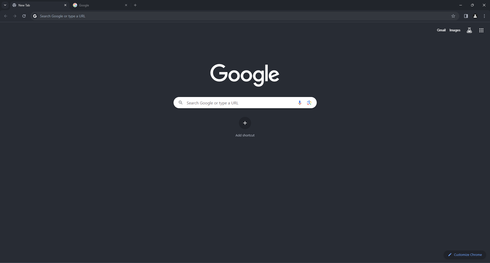
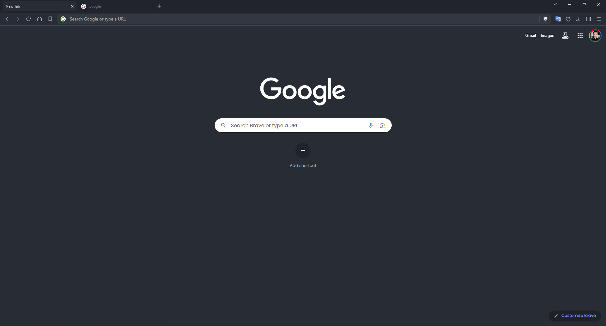
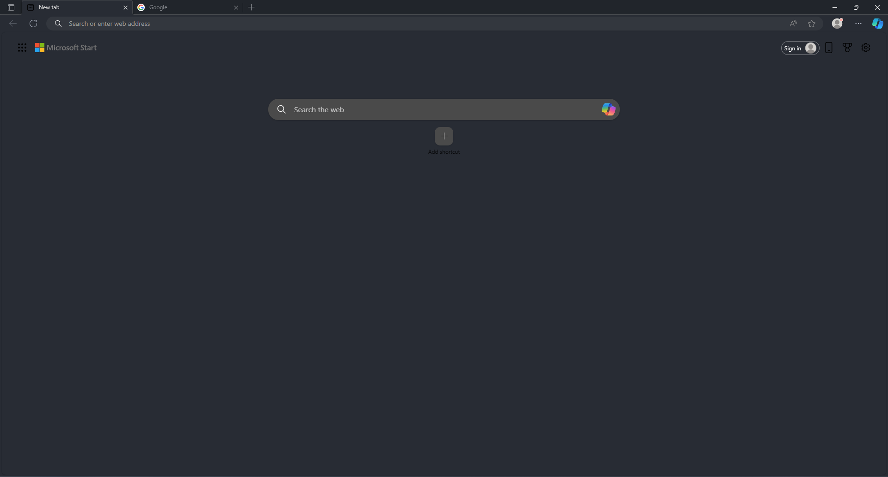

# One Dark Pro Theme for Chromium Browsers

## [GitHub Repo](https://github.com/VictorPLopes/OneDark-Pro-Chromium)

A port of [Binaryify's One Dark Pro theme for Visual Studio Code](https://github.com/Binaryify/OneDark-Pro) for Chromium-based browsers (Chromium, Chrome, Edge, Brave etc.). This teme isn't on the Chrome Web Store yet due to the developer registration fee.

## VictorPL's One Dark Collection

- [One Dark Pro for Visual Studio Code (by Binaryify)](https://github.com/Binaryify/OneDark-Pro)
- [One Dark Pro for Visual Studio (by Binaryify)](https://marketplace.visualstudio.com/items?itemName=zhuangtongfa.onedarkpro)
- [One Dark Pro for Windows Terminal](https://github.com/VictorPLopes/OneDark-Pro-Windows-Terminal)
- [One Dark Pro for Kitty Terminal](https://github.com/VictorPLopes/OneDark-Pro-Kitty-Terminal)
- [One Dark Pro for Chromium Browsers](https://github.com/VictorPLopes/OneDark-Pro-Chromium)
- [One Dark Pro for Starship Prompt](https://github.com/VictorPLopes/OneDark-Pro-Starship)
- [One Dark Pro for Neovim (by olimorris)](https://github.com/olimorris/onedarkpro.nvim)
- [One Dark Pro for iTerm (by chinhsuanwu)](https://github.com/chinhsuanwu/one-dark-pro-iterm)
- [One Dark for JetBrains IDEs (by Mark Skelton)](https://plugins.jetbrains.com/plugin/11938-one-dark-theme)

## Screenshots

### Chrome/Chromium

### Brave

### Edge

## How to install

First, download the latest [release](https://github.com/VictorPLopes/OneDark-Pro-Chromium/releases) and save it to your computer. Then, unzip the file and follow the instructions below (they might be slightly different depending on your browser):

1. Open the Extension Management page by navigating to [chrome://extensions](chrome://extensions).
2. The Extension Management page can also be opened by clicking in your browser's menu, then selecting `Extensions`.
3. Enable Developer mode by selecting that option at the top of the page.
4. Click on the `Load unpacked` button, then locate the folder where you unzipped the release and select it.
5. The theme should now be active in your browser. To remove the theme, go to your browser's theme/appearance settings and select a different theme.

## Support me

If you like this theme, and my work, you can always support me via **[Ko-fi](https://ko-fi.com/victorplopes)**. If I get enough support, I will pay the developer registration fee and publish this theme on the Chrome Web Store.
 

## [CHANGELOG](./CHANGELOG.md)
